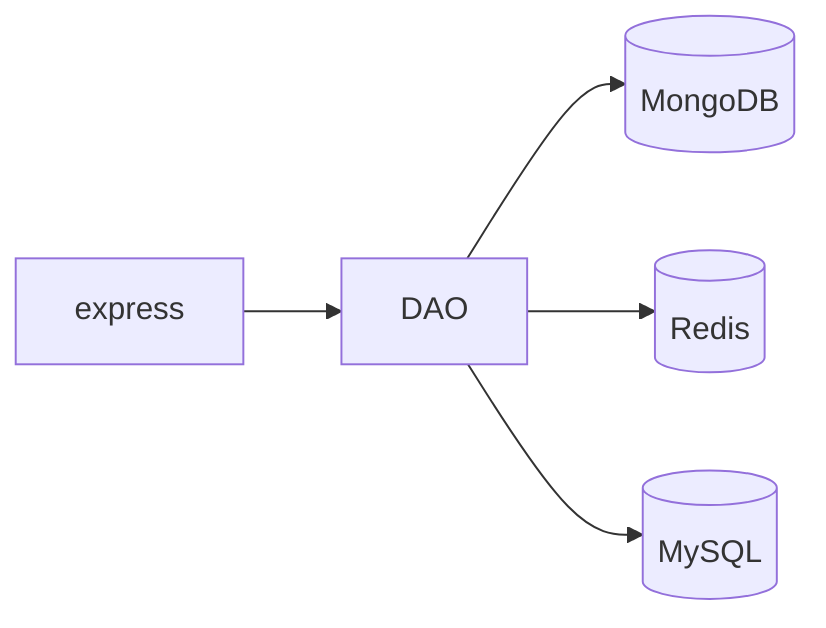

# auth-ts

TypeScript based authentication service.

:warning: :warning: WIP :warning: :warning:

## development

```bash
git clone https://github.com/hardenerdev/auth-ts.git
cd auth-ts
npm run dev
```

## test

```bash
git clone https://github.com/hardenerdev/auth-ts.git
cd auth-ts
npm run test
```

## architecture


